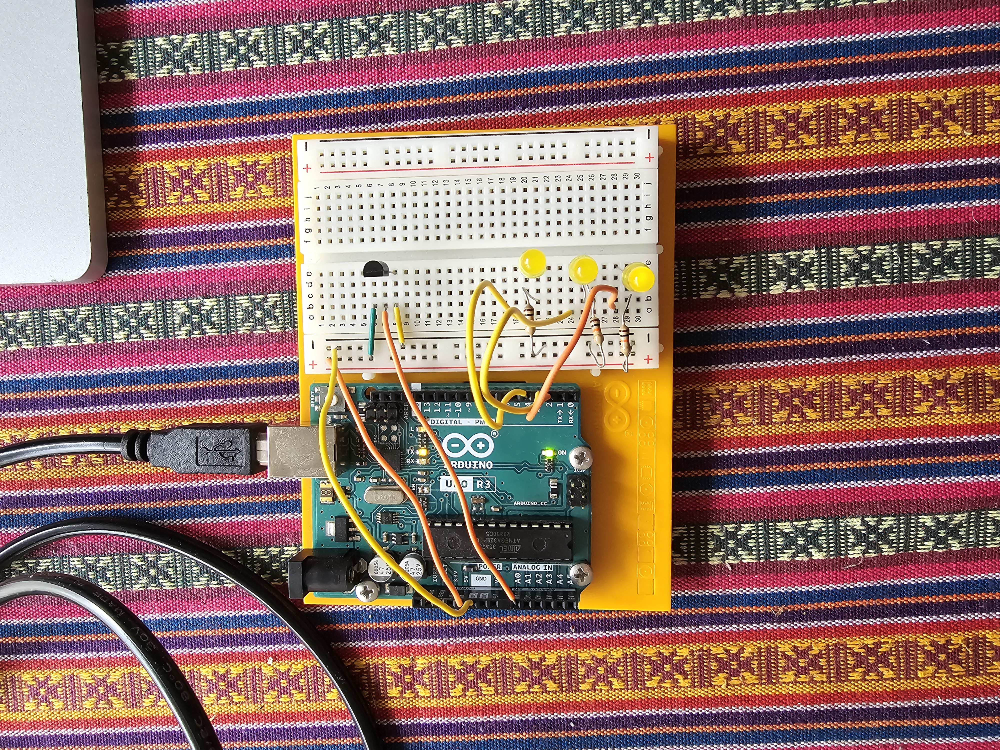

# Arduino-Uno-Project-03-Love-O-Meter
Love-O-Meter: This project uses an analog temperature sensor and the Arduino’s built-in ADC to measure skin temperature. The sensor output voltage changes with heat, and the Arduino reads these values to control LEDs that indicate different temperature levels.
**Goal:**  
Explore **analog inputs** using the Arduino’s built-in ADC to measure temperature. Learn how to read sensor values, convert them to meaningful units, and control multiple LEDs based on measured data.

In this project, a temperature sensor measures skin or ambient temperature. The Arduino reads the sensor voltage, converts it to degrees Celsius, and lights up **1, 2, or 3 LEDs** depending on how much the temperature exceeds a baseline value.

---

##  Components

- Arduino Uno  
- Breadboard  
- Analog temperature sensor  
- 3 LEDs (red recommended)  
- 3 × 1 kΩ resistors  
- Jumper wires  

---

##  Circuit Description

- **Analog input:** `A0` reads the temperature sensor voltage (0–5 V).  
- **Digital outputs:** Pins `2–4` control LEDs.  
- The baseline temperature is defined in code (`baselineTemp = 17°C`).  
- LEDs indicate temperature increase relative to baseline:  
  - **+2–4°C:** 1 LED blinks  
  - **+4–6°C:** 2 LEDs blink  
  - **>6°C:** all 3 LEDs blink  

---

##  Arduino Code

```cpp
const int sensorPin = A0;
const float baselineTemp = 17.0;

void setup() {
  Serial.begin(9600); 
  for(int pinNumber = 2; pinNumber<5; pinNumber++){
    pinMode(pinNumber,OUTPUT);
    digitalWrite(pinNumber,LOW);
  }
}

void loop() {
  int sensorVal = analogRead(sensorPin);
  Serial.print("Serial Value:  ");
  Serial.print(sensorVal);
  float voltage = (sensorVal/1024.0)*5.0;
  Serial.print(", Volts:  ");
  Serial.print(voltage);
  Serial.print(", degrees C:  ");
  float temperature = (voltage - 0.5) * 100;
  Serial.println(temperature);

  if(temperature < baselineTemp) {
    digitalWrite(2,LOW);
    digitalWrite(3,LOW);
    digitalWrite(4,LOW);
  } else if(temperature >= baselineTemp+2 && temperature < baselineTemp +4){
    digitalWrite(2,HIGH);
    digitalWrite(3,LOW);
    digitalWrite(4,LOW);
  } else if(temperature >= baselineTemp+4 && temperature < baselineTemp+6){
    digitalWrite(2,HIGH);
    digitalWrite(3,HIGH);
    digitalWrite(4,LOW);
  } else if(temperature >= baselineTemp+6){
    digitalWrite(2,HIGH);
    digitalWrite(3,HIGH);
    digitalWrite(4,HIGH);
  }
  delay(1);
}



